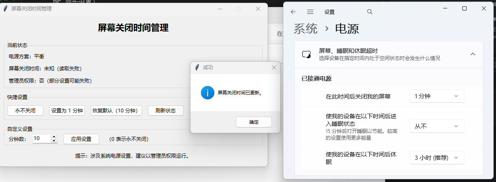

# 屏幕关闭时间管理

> 版本：v1.0 | 架构：.NET 10 WPF + MVVM

基于 **C# / .NET 10 WPF** 的 Windows 桌面工具，通过 `powercfg` 管理系统电源方案中的屏幕关闭时间，支持一键设置和自定义分钟数。



---

## 功能特性

| 功能 | 说明 |
|------|------|
| **状态查看** | 实时显示当前电源方案名称与屏幕关闭时间（AC/DC） |
| **快捷设置** | 一键设为"永不关闭 / 1 分钟 / 恢复默认 10 分钟" |
| **自定义设置** | 输入 0-1440 分钟，灵活设置屏幕关闭时间 |
| **管理员检测** | 自动检测是否以管理员权限运行，提示限制 |
| **异步操作** | 后台线程调用 powercfg，UI 不卡顿 |

---

## 系统架构

```
ScreenTimeoutManager/
├── ScreenTimeoutManager.slnx                 # 解决方案文件
├── src/
│   └── ScreenTimeoutManager/                 # 项目源码
│       ├── App.xaml / .cs                    # 应用程序入口
│       ├── MainWindow.xaml / .cs             # 主窗口 (UI + 数据绑定)
│       ├── app.manifest                      # 应用程序清单
│       ├── Resources/
│       │   └── Styles.xaml                   # 全局样式定义
│       ├── Models/
│       │   └── PowerSchemeInfo.cs            # 电源方案数据模型
│       ├── Services/
│       │   └── PowerSettingsService.cs       # powercfg 调用封装
│       └── ViewModels/
│           ├── ObservableObject.cs           # MVVM 基类 (INotifyPropertyChanged)
│           ├── RelayCommand.cs               # ICommand 实现
│           └── MainViewModel.cs              # 主视图模型
├── images/                                   # 截图
└── README.md                                 # 本文档
```

### 架构原则

- **MVVM 模式**：UI 与业务逻辑通过数据绑定解耦，View 不直接依赖 Service
- **异步编程**：powercfg 调用使用 `Task.Run` 在后台线程执行，避免 UI 线程阻塞
- **Service 封装**：所有 powercfg 命令行交互统一封装在 `PowerSettingsService` 中，ViewModel 不直接操作进程
- **Windows 原生 API**：通过 `WindowsPrincipal` 检测管理员权限，无需额外依赖

---

## 技术栈

| 技术 | 用途 |
|------|------|
| .NET 10 / WPF | 桌面应用框架 |
| System.Diagnostics.Process | 调用 powercfg 命令 |
| System.Security.Principal | 管理员权限检测 |
| MVVM (ObservableObject + RelayCommand) | UI 与业务逻辑解耦 |

---

## 快速开始

### 环境要求

- Windows 10/11 (64位)
- .NET 10 SDK

### 编译运行

```bash
# 进入项目目录
cd 004一款电脑定时关屏幕小工具/ScreenTimeoutManager

# 还原依赖
dotnet restore src/ScreenTimeoutManager/ScreenTimeoutManager.csproj

# 编译
dotnet build src/ScreenTimeoutManager/ScreenTimeoutManager.csproj

# 运行
dotnet run --project src/ScreenTimeoutManager/ScreenTimeoutManager.csproj
```

### 打包为 exe

```bash
# 发布为单文件 exe（含压缩）
dotnet publish ScreenTimeoutManager.csproj -c Release -r win-x64 --self-contained true -p:PublishSingleFile=true -p:EnableCompressionInSingleFile=true -p:IncludeNativeLibrariesForSelfExtract=true -o ../dist
```

打包完成后生成 `dist\ScreenTimeoutManager.exe`，可直接双击运行。

---

## 使用说明

### 基本操作

1. **查看状态**：启动程序后自动读取当前电源方案名称与屏幕关闭时间
2. **快捷设置**：点击"永不关闭 / 1 分钟 / 恢复默认 10 分钟"按钮快速应用
3. **自定义设置**：在输入框中输入分钟数（0 表示永不关闭），点击"应用设置"
4. **刷新状态**：点击"刷新状态"按钮手动刷新当前电源方案信息

### 注意事项

- 修改系统电源策略建议以管理员权限运行程序
- 若电源方案被系统策略（如组策略）限制，设置可能失败
- 程序会自动检测管理员权限并在状态区显示

---

## 配置说明

### 电源方案

- 程序读取当前活动电源方案（`powercfg /GETACTIVESCHEME`）
- 同步设置 AC（电源供电）和 DC（电池供电）的屏幕关闭时间

### 超时时间

- 设置为 0 表示永不关闭屏幕
- 范围：0-1440 分钟（24 小时）
- 当 AC/DC 设置不一致时，分别显示两个值

---

## 开发计划

### 近期计划

- [ ] 支持分别设置 AC/DC 超时时间
- [ ] 多电源方案管理与切换
- [ ] 结果导出（当前方案配置快照）

### 中期计划

- [ ] 定时任务（在指定时间自动切换设置）
- [ ] 托盘图标 + 后台运行
- [ ] 快捷键支持（快速切换预设模式）