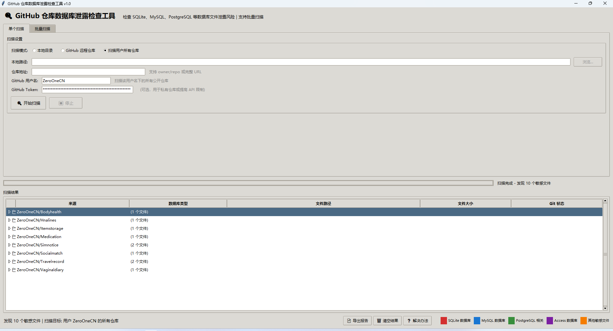
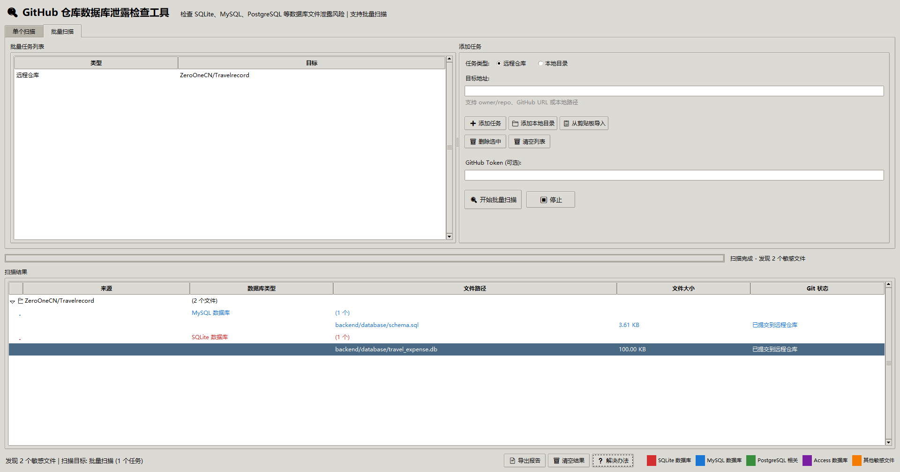

# GitHub 仓库敏感文件泄露检查工具

一款用于检查 GitHub 仓库中敏感文件泄露风险的图形化工具。

## 功能特性

### 多种扫描模式
- **本地目录扫描**：扫描本地 Git 仓库中的敏感文件
- **远程仓库扫描**：扫描 GitHub 远程仓库
- **用户仓库批量扫描**：扫描指定用户名下的所有公开仓库

### 支持的敏感文件类型
| 类型 | 文件扩展名 |
|------|-----------|
| SQLite 数据库 | `.db`, `.db3`, `.sqlite`, `.sqlite3`, `.sqlite2` |
| MySQL 数据库 | `.sql`, `.mysqldump` |
| PostgreSQL 相关 | `.pgpass`, `.psql_history` |
| Access 数据库 | `.accdb`, `.mdb` |
| 其他敏感文件 | `.bak`, `.backup`, `.env`, `database.json`, `credentials.json` 等 |

### 主要功能
- 自动检测仓库默认分支
- 实时扫描进度显示
- 风险等级自动评估（低危/中危/高危/严重）
- 详细的解决方案建议
- 多格式报告导出（TXT/JSON/CSV）
- 批量任务管理
- GitHub Token 支持（提高 API 限制）

## 安装

### 环境要求
- Python 3.7+
- 依赖库：`requests`（可选，用于远程扫描）

### 安装依赖
```bash
pip install requests
```

### 运行
```bash
python 一款敏感文件检查的小工具.py
```

## 使用说明

### 单个扫描



1. 选择扫描模式：
   - **本地目录**：选择本地文件夹进行扫描
   - **GitHub 远程仓库**：输入仓库地址（支持 `owner/repo` 或完整 URL）
   - **扫描用户所有仓库**：输入 GitHub 用户名，扫描其所有公开仓库

2. 点击"开始扫描"按钮

3. 查看扫描结果，双击可在浏览器中打开远程文件

### 批量扫描



1. 切换到"批量扫描"标签页
2. 添加扫描任务：
   - 选择任务类型（本地目录/远程仓库）
   - 输入目标路径或仓库地址
   - 点击"添加任务"
3. 支持从剪贴板批量导入
4. 点击"开始批量扫描"

### GitHub Token 配置

使用 GitHub Token 可以：
- 提高 API 请求限制（从 60次/小时 提升到 5000次/小时）
- 访问私有仓库

#### 生成 Fine-grained Personal Access Token

**步骤一：进入 Token 设置页面**
1. 登录 GitHub，点击右上角头像 → **Settings**
2. 左侧边栏最底部，点击 **Developer settings**
3. 点击 **Personal access tokens** → **Fine-grained tokens**
4. 点击 **Generate new token**

**步骤二：配置 Token 参数**

| 参数 | 推荐设置 |
|------|----------|
| Token name | `repo-scanner`（自定义名称，便于识别） |
| Expiration | 建议 **30 days** 或 **90 days**，避免长期暴露 |
| Resource owner | 选择你的用户名 |
| Repository access | **Only select repositories** → 勾选需要扫描的仓库（最小权限原则） |

**步骤三：配置权限（最小权限原则）**

只需选择以下两个权限：

| 权限 | 级别 | 用途 |
|------|------|------|
| **Contents** | Read-only | 读取仓库的文件列表和文件内容，扫描敏感文件的基础 |
| **Metadata** | Read-only | 读取仓库的基本信息（默认已勾选） |

> ⚠️ **权限选择原则**：按需分配，最小权限。不需要 `repo` 完整权限，只需 `Contents: Read-only` 即可满足扫描需求。

**步骤四：获取并保存 Token**
1. 点击 **Generate token**
2. 立即复制生成的以 `github_pat_` 开头的字符串
3. **Token 只显示一次，请妥善保存**

#### 在工具中使用 Token

将生成的 Token 填入工具界面的 "GitHub Token" 输入框即可。

> 💡 **提示**：如果只需要扫描公开仓库，可以不使用 Token，但 API 请求限制为 60次/小时。

## 扫描结果

### 风险等级说明
| 等级 | 图标 | 说明 |
|------|------|------|
| 低危 | 🟢 | 公开数据文件，风险较低 |
| 中危 | 🟡 | SQL 脚本等，可能暴露数据库结构 |
| 高危 | 🟠 | 二进制数据库文件，可能包含真实数据 |
| 严重 | 🔴 | 包含凭证、密码等敏感信息的文件 |

### 结果操作
- **双击**：在浏览器中打开远程文件 / 打开本地文件夹
- **右键**：复制 URL、复制路径、打开文件夹
- **导出报告**：导出 TXT/JSON/CSV 格式报告
- **解决办法**：查看详细的修复建议

## 报告示例

```
================================================================================
GitHub 仓库数据库泄露检查报告
================================================================================

📅 扫描时间: 2026-03-19 13:14:17
📊 发现问题: 10 个敏感文件
📁 涉及仓库: 8 个

================================================================================
📦 仓库: ZeroOneCN/Simnotice
================================================================================

  [1] 文件: backend/data/simnotice.db
      类型: SQLite 数据库
      大小: 32 KB
      状态: ✅ 确认存在
      链接: https://github.com/ZeroOneCN/Simnotice/blob/main/backend/data/simnotice.db
      风险等级: 🟠 高危
      风险原因: 二进制数据库文件，可能包含真实数据

================================================================================
📈 风险统计
================================================================================
  • 总计发现: 10 个敏感文件
  • 涉及仓库: 8 个
  • 高危文件: 5 个
  • 严重风险: 2 个
```

## 解决方案

### 立即行动
1. 将敏感文件模式添加到 `.gitignore`：
   ```
   *.db
   *.sqlite
   *.sql
   *.env
   *.bak
   ```

2. 从 Git 历史中移除敏感文件：
   ```bash
   # 使用 git filter-branch
   git filter-branch --force --index-filter \
     "git rm --cached --ignore-unmatch PATH/TO/FILE.db" \
     --prune-empty --tag-name-filter cat -- --all
   git push origin --force --all
   ```

3. 使用 BFG Repo-Cleaner（推荐）：
   ```bash
   java -jar bfg.jar --delete-files '*.db'
   git reflog expire --expire=now --all
   git gc --prune=now --aggressive
   git push origin --force --all
   ```

### 后续加固
- 轮换所有可能泄露的密码和密钥
- 使用环境变量管理敏感配置
- 启用 pre-commit 钩子自动检查
- 启用 GitHub Secret Scanning 功能

## 注意事项

- GitHub API 有速率限制，建议使用 Token
- 重写 Git 历史会影响所有协作者，操作前请备份
- 如果仓库有 Fork，清理历史后文件仍可能存在于 Fork 中
- 对于严重敏感数据泄露，建议联系 GitHub 支持